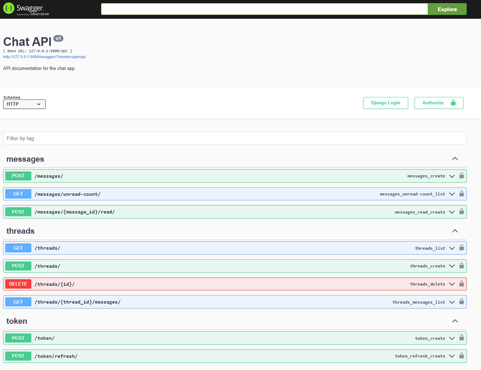

# Chat API

A simple messaging API built with Django REST Framework.

## Setup

### Prerequisites
- Python 3.11+
- Docker (if using containerization)

## Using docker
``` docker-compose up --build```

### Credentials for superuser
#### Login:
##### root
#### Password:
##### qwerty

## Running Locally

### Install dependencies:
``` pip install -r requirements.txt```

### Apply migrations:
``` python manage.py migrate```

### Load data
```p ython manage.py loaddata db_dump.json```

### Create a superuser:
``` python manage.py createsuperuser```

### Run the server:
``` python manage.py runserver```

## API will be available at:
http://127.0.0.1:8000/swagger/

http://127.0.0.1:8000/admin/

## Endpoints:

